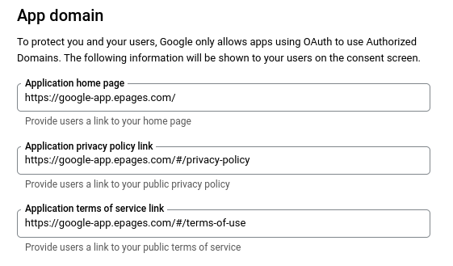
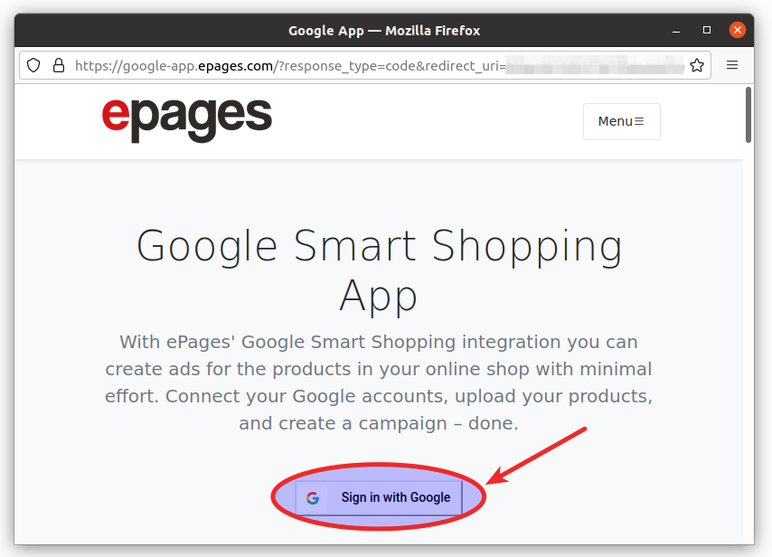

# Google App

This repository hosts the app home page for the ePages integration with Google Smart Shopping.

## Features

### Explains the Smart Shopping integration

For the OAuth app verification the app homepage needs to fulfil the following requirements:

- Explain the app features
- Explain how the app uses the user's data
- Link to the privacy policy
- Use the ePages branding

See [support.google.com](https://support.google.com/cloud/answer/9110914#verification-requirements&zippy=%2Cwhat-are-the-requirements-for-verification) for details.

### Hosts legal documents

In the OAuth consent screen configuration we need to provide links to the app's privacy policy and the terms of use.

- https://google-app.epages.com/#/privacy-policy
- https://google-app.epages.com/#/terms-of-use



### Proxies the OAuth flow

It is important to Google that the user can trust the redirect URI where the authorization server redirects the browser to after the API consent. So, the redirect URL needs to be on the same domain like from where they started. Since the authorized redirect URIs need to be allow-listed, this cannot under the shop domain. So, we have the app homepage as intermediary step in the OAuth flow.


1. Instead of contacting the autorization server directly from the shop administration, we are sending the parameters which we would normally send there to the app homepage. The app homepage then provides a "Sign in with Google" button using those parameters.



2. After clicking on that button, you will be send to Google's authorization server.
3. Once the API consent has been given, the authorization server will redirect you back to the app homepage.


4. After a countdown of three seconds, there will be an automatic redirect to a redirect microservice.
5. That microservice will eventually dispatch the request to the ePages installation where the tokens get generated. The dispatching is happening with the help of the `scope` request parameter.

### Localizes content

Our Google app supports German, English, Spanish, and Dutch.
We determine which language to use based on the user's browser language.

### Prepares token generation

As a bonus feature, you can use the app homepage to help you manually generate access tokens. If you add only the `?client_id=xxxx` parameter to the homepage, the "Sign in with Google" button will be rendered with the default parameters and scopes required for the Google Smart Shopping app. Instead of redirecting you back to a shop, the app homepage will render a cURL snippet which you can run in your terminal for manual token generation.

- [App Homepage / Sandbox Client ID](https://google-app.epages.com?client_id=746318976034-e9r0hta4db0d21e56d7eh1nhi8n4kj4d.apps.googleusercontent.com)
- App Homepage / Production Client ID

## Development

### Dependencies

To work on the Google app homepage, you need to have the current [LTS version of NodeJS](https://nodejs.org/en/download/) installed on your laptop.

### Start app

To start the development server, clone the repository, install the dependencies, and then call the `start` task.

```
$ git clone git@github.com:ePages-de/google-app.git
$ cd google-app
$ npm install
$ npm start
```

Then, the app will be accessible at http://localhost:3000 .

### Show the Google login button

The Google login button only appears on the page if the OAuth request parameters are provided. For testing, you can call the app homepage with the client ID of our sandbox OAuth app:

http://localhost:3000?client_id=746318976034-e9r0hta4db0d21e56d7eh1nhi8n4kj4d.apps.googleusercontent.com


### Localization

```jsx
{ i18n.t('views.homepage.navbar.concept.label') }
```

```jsx

```

## Testing

### OAuth start

### OAuth end

## Deployment

### Render release files

```
$ npm ci
$ npm run build
$ ls -l build
-rw-rw-r-- 1 jdoe jdoe 1109 Nov 12 17:55 asset-manifest.json
-rw-rw-r-- 1 jdoe jdoe 3870 Nov 12 17:55 favicon.ico
drwxrwxr-x 3 jdoe jdoe 4096 Nov 12 17:55 img
-rw-rw-r-- 1 jdoe jdoe 2249 Nov 12 17:55 index.html
drwxrwxr-x 2 jdoe jdoe 4096 Nov 12 17:55 legal-content
-rw-rw-r-- 1 jdoe jdoe   67 Nov 12 17:55 robots.txt
drwxrwxr-x 5 jdoe jdoe 4096 Nov 12 17:55 static
```
 
### Publish to GitHub pages

```
npm run deploy
```

## References

- https://stackoverflow.com/questions/59793437/example-of-an-oauth-homepage-for-google
- https://support.google.com/cloud/answer/9110914?hl=en

## Copyright

© ePages GmbH 2021. All rights reserved.
